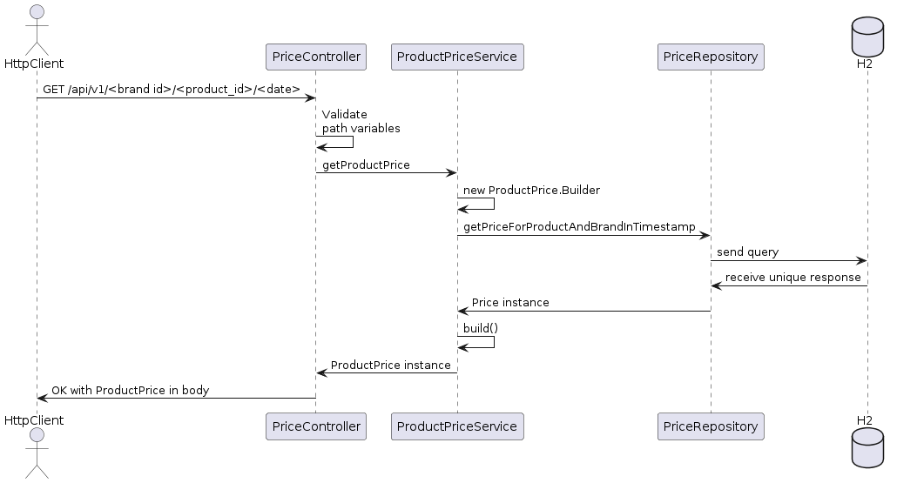

# Design

## Use Case
The use case involves a request to a REST API service that has to determine the right price to deliver to the client based on three variables:
- Brand
- Product
- Date

The resulting price will be a data structre containing the following fields:
- Product Id
- Brand Id
- Price List Id
- Start Date
- End Date
- Final Price

### Data Layer

We were explicitly asked to use an in-memory database to do this project, for which we will use H2.

The H2 instance is managed by spring boot and accessed via Hibernate, but provisioned with an schema and initial data provided in the exercise before the service is operational.

This schema can be found in file [data.sql](https://github.com/jairomer/BackendWithSpringBoot/blob/master/src/main/resources/data.sql) on this repository.

## Expected behavior

### Case: Happy Path 

### Case: Database Error 

### Case: Bad Request

## Design Patterns Used

For this service, we needed a way to create instances of `ProductPrice` that could meet certain guarantees.
- Product, Brand and Price List IDs need to be positive numbers because they correspond to database IDs.
- A start date must come before an end date.
- A final price needs to have at most a scale of 2 decimals and have a non-negative value.

To implement this, we have provided a static builder class within the `ProductPrice` class to generate well constructed instances that validate these requirements.

If these requirements are not met, a typed Exception shall be thrown by this builder to notify user code that the inserted information do not qualify with the requirements of the `ProductPrice` class.

In this particular use case, this pattern could be useful to detect inconsistencies in the rows stored in the database for the price.
However, it would be most useful during the price list creation use case.

The implementation of this pattern was also an opportunity to show off how JUnit tests could be used in these kinds of services.

